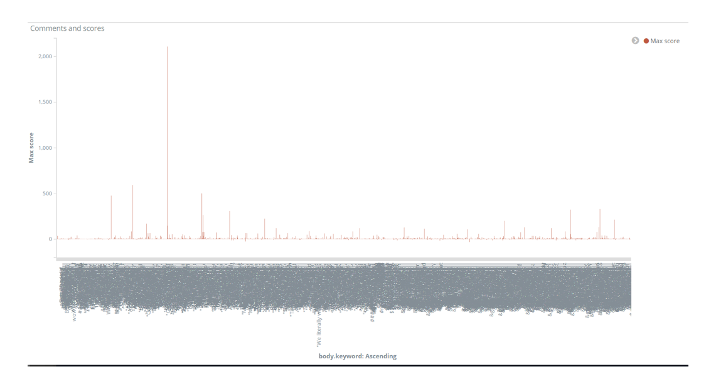
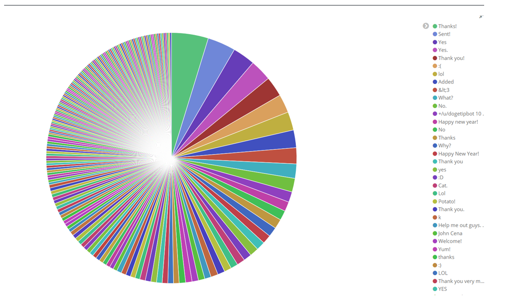
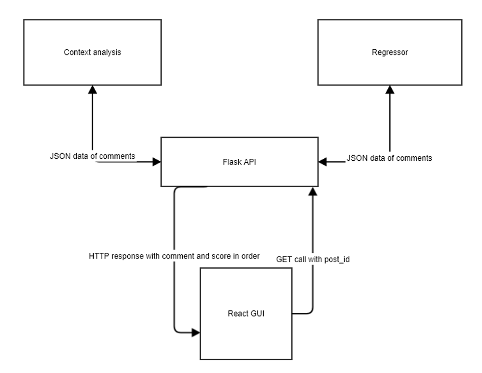
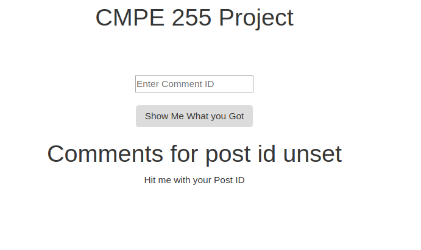
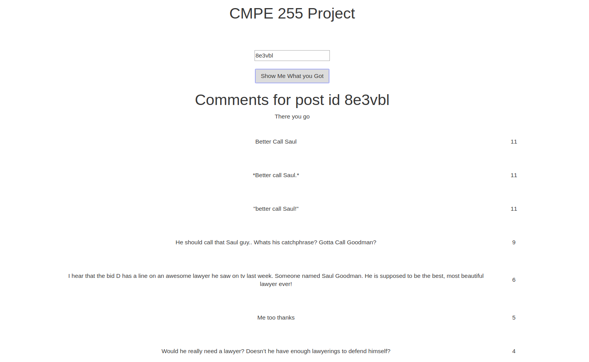

# SJSU CMPE 255 Spring'18 Project Report

# Karma Mining

# Pranav Prem

## Section 1 Introduction
Reddit it a social media platform that is famously branded as the “Front page of the internet” for being a one stop shop for real time information sharing.
Reddit itself is divided into subreddits which focus on a specific topic (e.g. world news, Pokémon, data mining) and each subreddit will have multiple posts relevant to the subreddit. Each post further has several comments with upvotes and downvotes for each comment.

### Motivation
Being an avid redditor for the past 4 years, the trend I have noticed with reddit posts is that the upvotes for comments are never quite accurate. Having information pertaining to which comments on a post are good come from crowdsourcing upvotes and downvotes results in many good comments being buried and forgotten because they were posted much after the post itself. Further, the upvoting system itself, being dependent on users, is highly unpredictable.

### Objective
Hence, we have designed a system that can analyse the comments on any post in reddit, use data mining concepts from this class to determine how good a comment is, and provide it a score for the number of upvotes it’s expected to receive. Further, the system will sort the comments based on these scores and display them in the GUI.

### Literature Review
While multiple attempts have been made to see what comments get upvoted on reddit, there has been no real effort to predict what score a comment could get in the future. To accomplish this, multiple data mining techniques were used key of which were Latent Semantic Analysis and Bayesian Ridge Regression – both of which were found to be fast and suited perfectly for the task at hand.
Unsurprisingly enough, most attempts at analysing Reddit itself have come from the subreddit r/datamining (including the data set used for this project). Redditors have tried building a classifier that can tag a comment as “Top”, “Meh” or “Controversial” and have had fair amounts of success at the same using CNNs. However, the task we look to accomplish involves building a regression model for the comments that can predict a specific score.

## Section2 System Design & Implementation details
## Algorithms
1. Pruning data
To prune data, first all words are converted into lower case, all punctuation is removed, all non-English words are removed, all English stop words are removed all words are stemmed and a TD-IDF sparse matrix is produced.
Feature selection was also done for the regression model selecting 8,000 best features out of 100,000. We arrived at this value by experimenting with numbers ranging from 2,000 to 10,000 in steps of 500.
2. Building the regression model
First, multiple regression methods were attempted – Least angle regression and random forests with boosting. In each case, it was observed that given the size of the dataset and the rather random distribution of highly upvoted comments, the models were very quickly being overfitted. 
To reduce overfitting and build a faster model, we switched to Bayesian Ridge Regression which immediately gave us much better results with a lower Root Mean Square Error than the others. The results of this were still inaccurate because the relevance of a comment to a post was still not being taken into consideration.
3. Understanding context
To understand the relevance of a comment to a post, first we tried calculating its cosine similarity with the title of the post. This turned out to not be helpful given the titles of posts generally contain very limited information regarding what the post is about. To find a way around this, we used concepts from Latent Semantic Analysis which is generally used to in web crawlers to extract relevant information. LSA is based on the principle that pieces of similar meaning will have similar words. 
In our project, we find the cosine similarity between every comment within a post and assign the average as its score. Sorting posts using this score, it is seen that comments which are highly relevant to the topic are at the top. 
We then combine this score with the prediction of the regression model to develop a new score based on its relevance to the post and overall comment pattern of reddit.
This new score is found to reduce the root mean square error. Additionally, the combined score is found to be able to better identify highly upvoted comments.

 
### Technologies & Tools used
Languages used: Python 2.7, ReactJS
Libraries: nltk, praw, sklearn, numpy, pandas, flask
Tools: EmEditor (for 50gb text data file), ElasticSearch and Kibana (for data visualization), Jupyter Notebook, Sublime Text and VSCode (for code)

### Architecture-related decisions
We decided to build the system to take a post id and display the comments within the post with their scores in order of the scores. 
To build the system in this fashion we built the API to accept a post id, draw the comments using the Reddit API and send them to the regression model and builds context. The API then combines the results and develops a JSON to return.
We built a GUI in react to accept a post id and send it to the API to get the results and display them in a sorted order.

### System Architecture

### Component Details:
The Context Analysis component accepts a json array of comments, prunes them, finds the correlation of every comment to all other comments and returns this in a json array of objects containing the comment and the score.
The Regression model accepts JSON array of comments, prunes them and provides them to a trained Bayesian ridge regression model to obtain scores for each comment.

The Flask API accepts only a get method at the REST endpoint and takes post_id in the from the URL. It then uses the reddit API to fetch the comments and supply them to the pre-trained Regression model and the contextual analyser each of which will return their scores. The Flask API will combine them and return a sorted list of comments to the front end.
The front end will iterate over and display the comments.

GUI Screenshots

## Section 3 Experiments
### Dataset used
The dataset, taken from Reddit, has 2.5 Billion Reddit comments that have been posted for years since the Website has been public. (https://www.reddit.com/r/datasets/comments/3bxlg7/i_have_every_publicly_available_reddit_comment/) Sample Json of data: {"gilded":0,"author_flair_text":"Male","author_flair_css_class":"male","retrieved_on":1425124 228,"ups":3,"subreddit_id":"t5_2s30g","edited":false,"controversiality":0,"parent_id":"t1_cnap n0k","subreddit":"AskMen","body":"I can't agree with passing the blame, but I'm glad to hear it's at least helping you with the anxiety. I went the other direction and started taking responsibility for everything. I had to realize that people make mistakes including myself and it's gonna be alright. I don't have to be shackled to my mistakes and I don't have to be afraid of making them. ","created_utc":"1420070668","downs":0,"score":3,"author":"TheDukeofEtown","archived":fals e,"distinguished":null,"id":"cnasd6x","score_hidden":false,"name":"t1_cnasd6x","link_id":"t3_2 qyhmp"}
The “score” field is taken as the score of the comment. The body filed is taken as the text in the comment. These two are the primary fields used in processing.
Using all 2.5 billion comments was a not possible during the project as the file containing this data itself was ~30gb. To train the model, we used ~1.2 million comments.

### Methodology followed
The dataset was split into ~1 million for training and 100,000 for testing.
We began training various regression models for 1 million comments and finding the root mean squared error of testing with 100,000 comments. To reduce overfitting in LARS, we tried Cross Validation, but it did not improve the root mean square error by much (~350). We also tried Random Forests but we could not find an appropriate value for the root mean square error to be lower than 400. 
We then switched to using Bayesian Ridge Regression model which gave us much lesser RMSE (~180). 

### Analysis of results
The regression model was seen to assign higher scores to positive comments while the context analysis assigned higher scores for comments which were relevant to the post.
Even though the mean squared error was high, the comments obtained as top comments were funnier and more relevant to the post than the top comment in most cases. 
Reddit tropes (common comments that are found over reddit that just get upvotes for being there e.g. – firefly references, it’s always sunny references) were being assigned higher scores by the regressor. And were shown by the system even though they were not relevant to the post.
The system works best for posts about world news and facts and has higher mean squared error for posts about from subreddits like “r/aww” with animal pictures.
The system does not work well for comments that are sarcastic or contain non-English words (including URLs).

### Section4 Discussion & Conclusions
Decisions made
-	model for regression
-	pruning mechanism
-	parameter for number of features to be selected
-	contextual analysis algorithm
-	json format for object to be returned by API
-	front end technologies

### Difficulties faced
The dataset was one 30gb text file which made it very difficult to manage. We used EmEditor to read and split the text file after even terminal editors like vi failed to open the file. Selecting an appropriate section ~100-150mb section of this 30gb file to use also took time since we had to select comments with varied scores.
### Things that worked
The comment scores generated by the system seem realistic, if slightly scaled down for popular subreddits or scaled up from less popular subreddits. It showed good comments at the top and bad comments at the bottom. 
Things that didn’t work well
We were not able to leverage the full benefit of the HPC and regret not being able to try for much larger datasets given how this performed on 1/1000th of the complete dataset.
### Conclusion
-	Combining multiple approaches to the same problem yields better results
-	Bayesian Ridge Regression models are the fastest to use and provide the best results for text data
-	If a comment has words that are found in a lot of other comments, it can be considered relevant to topic.
-	The context analysis done on the comments yielded comments relevant to the post.
-	Redditors do not upvote toxicity.
